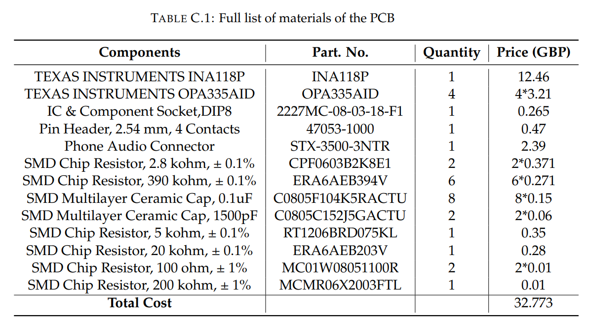

# An-Amplification-Circuit-for-EMG
An amplification circuit for EMG. It adopts the classic Driven Right Leg (DRL) circuit scheme. It achieves a 64.3dB SNR and has a compact size of 66.2 mm×24.4 mm. The schematic and layout is shown below, and they are created with KiCAD. 

## Schematic
[here](KiCADSchem.pdf)

## Layout
[here](KiCADLayout.pdf)

## A typical waveform produced by the circuit
[here](contraction.pdf)

## Full list of materials

